# Entity Relationship Diagram (ERD) - POS SaaS System

## Complete ERD - All Tables and Relationships

```mermaid
erDiagram
    %% Core System
    businesses ||--o{ users : "has employees"
    businesses ||--o{ outlets : "has outlets"
    businesses ||--o{ products : "owns products"
    businesses ||--o{ categories : "has categories"
    businesses ||--o{ customers : "has customers"
    businesses ||--o{ suppliers : "has suppliers"
    businesses ||--o| business_subscriptions : "has subscription"
    businesses ||--o{ business_settings : "has settings"
    businesses ||--o{ activity_logs : "logs activities"

    roles ||--o{ users : "assigned to"

    users }o--|| outlets : "assigned to"
    users ||--o{ orders : "creates orders"
    users ||--o{ attendances : "has attendance"
    users ||--o{ cash_drawer_sessions : "operates drawer"
    users ||--o{ activity_logs : "performs actions"

    outlets ||--o{ stocks : "holds inventory"
    outlets ||--o{ orders : "processes sales"
    outlets ||--o{ shifts : "has shifts"
    outlets ||--o{ printers : "has printers"
    outlets ||--o{ attendances : "records attendance"

    %% Products & Inventory
    categories ||--o{ products : "categorizes"
    suppliers ||--o{ products : "supplies"
    business_settings ||--o{ products : "default tax"

    products ||--o{ product_variants : "has variants"
    products ||--o{ stocks : "tracked in"
    products ||--o{ order_items : "sold in"
    products ||--o{ purchase_order_items : "ordered in"
    products ||--o{ stock_transfer_items : "transferred in"
    products ||--o{ order_return_items : "returned in"

    stocks ||--o{ stock_histories : "has history"

    %% Purchase Orders
    suppliers ||--o{ purchase_orders : "supplies to"
    outlets ||--o{ purchase_orders : "receives at"
    businesses ||--o{ purchase_orders : "creates"

    purchase_orders ||--o{ purchase_order_items : "contains"

    %% Stock Transfers
    businesses ||--o{ stock_transfers : "manages"
    stock_transfers }o--|| outlets : "from outlet"
    stock_transfers }o--|| outlets : "to outlet"
    stock_transfers ||--o{ stock_transfer_items : "contains"

    %% Orders & Sales
    customers ||--o{ orders : "places orders"
    outlets ||--o{ orders : "processes at"

    orders ||--o{ order_items : "contains"
    orders ||--o{ order_payments : "paid by"
    orders ||--o{ order_taxes : "taxed with"
    orders ||--o{ order_discounts : "discounted with"
    orders ||--o{ order_returns : "returned via"

    order_returns ||--o{ order_return_items : "contains"

    business_settings ||--o{ order_taxes : "applied as"
    business_settings ||--o{ order_discounts : "applied as"

    %% Cash Management
    outlets ||--o{ cash_drawer_sessions : "manages cash at"
    cash_drawer_sessions ||--o{ cash_transactions : "records"

    %% Subscriptions
    subscription_plans ||--o{ business_subscriptions : "subscribed to"
    business_subscriptions ||--o{ subscription_invoices : "billed via"
    subscription_invoices ||--o{ subscription_payments : "paid by"

    %% Promotions
    businesses ||--o{ promotions : "creates"
    promotions ||--o{ promotion_product : "applies to products"
    promotions ||--o{ promotion_category : "applies to categories"
    products ||--o{ promotion_product : "featured in"
    categories ||--o{ promotion_category : "featured in"

    %% Employee Management
    outlets ||--o{ shifts : "schedules"
    shifts ||--o{ attendances : "tracks"

    %% Reporting
    businesses ||--o{ sales_summaries : "summarized"
    businesses ||--o{ sales_transactions : "detailed"
    outlets ||--o{ sales_summaries : "per outlet"
    outlets ||--o{ sales_transactions : "per outlet"
    products ||--o{ sales_transactions : "sold"

    %% Table Definitions
    businesses {
        bigint id PK
        string name UK
        bigint owner_id FK
        string address
        string phone
        string email
        string tax_id
        string logo
        bigint current_subscription_id FK
        string subscription_status
        string status
        timestamp activated_at
        timestamp expired_at
        timestamps created_updated
    }

    users {
        bigint id PK
        string name
        string email UK
        string password
        bigint role_id FK
        bigint business_id FK
        bigint outlet_id FK
        string phone
        timestamp email_verified_at
        timestamps created_updated
    }

    roles {
        bigint id PK
        string name UK
        timestamps created_updated
    }

    outlets {
        bigint id PK
        string name
        bigint business_id FK
        string address
        string phone
        text description
        timestamps created_updated
    }

    products {
        bigint id PK
        string name
        bigint category_id FK
        bigint business_id FK
        bigint supplier_id FK
        bigint tax_id FK
        text description
        string image
        string color
        decimal price
        decimal cost
        string barcode
        string sku UK
        string unit_type
        int stock_minimum
        int reorder_point
        int optimal_stock_level
        string product_type
        string status
        boolean is_stock_managed
        boolean is_featured
        timestamp deleted_at
        timestamps created_updated
    }

    product_variants {
        bigint id PK
        bigint product_id FK
        string variant_name
        string sku UK
        string barcode
        decimal price_adjustment
        decimal cost_adjustment
        json attributes
        string image
        int sort_order
        string status
        timestamp deleted_at
        timestamps created_updated
    }

    categories {
        bigint id PK
        string name
        bigint business_id FK
        timestamps created_updated
    }

    stocks {
        bigint id PK
        bigint product_id FK
        bigint outlet_id FK
        int quantity
        timestamps created_updated
    }

    stock_histories {
        bigint id PK
        bigint stock_id FK
        bigint user_id FK
        bigint outlet_id FK
        int quantity
        int current_stock
        string type
        string reference
        text note
        timestamps created_updated
    }

    suppliers {
        bigint id PK
        bigint business_id FK
        string name
        string code
        string contact_person
        string phone
        string email
        text address
        string payment_terms
        text notes
        string status
        timestamp deleted_at
        timestamps created_updated
    }

    purchase_orders {
        bigint id PK
        bigint business_id FK
        bigint outlet_id FK
        bigint supplier_id FK
        bigint created_by FK
        bigint received_by FK
        string po_number UK
        string reference
        date order_date
        date expected_date
        date received_date
        string status
        decimal total_amount
        text notes
        timestamp deleted_at
        timestamps created_updated
    }

    purchase_order_items {
        bigint id PK
        bigint purchase_order_id FK
        bigint product_id FK
        int quantity_ordered
        int quantity_received
        decimal unit_cost
        decimal total_cost
        text notes
        timestamps created_updated
    }

    stock_transfers {
        bigint id PK
        bigint business_id FK
        bigint from_outlet_id FK
        bigint to_outlet_id FK
        bigint requested_by FK
        bigint approved_by FK
        bigint sent_by FK
        bigint received_by FK
        string transfer_number UK
        date transfer_date
        date sent_date
        date received_date
        string status
        text notes
        timestamp deleted_at
        timestamps created_updated
    }

    stock_transfer_items {
        bigint id PK
        bigint stock_transfer_id FK
        bigint product_id FK
        int quantity_requested
        int quantity_sent
        int quantity_received
        text notes
        timestamps created_updated
    }

    customers {
        bigint id PK
        bigint business_id FK
        string name
        string phone
        string email
        text address
        int loyalty_points
        decimal total_spent
        int visit_count
        timestamp last_visit_at
        date birthdate
        string customer_group
        text notes
        timestamp deleted_at
        timestamps created_updated
    }

    orders {
        bigint id PK
        string order_number UK
        bigint outlet_id FK
        bigint customer_id FK
        decimal sub_total
        decimal total_price
        int total_items
        decimal tax
        decimal discount
        string payment_method
        string payment_status
        decimal cash_received
        decimal change
        text notes
        string status
        bigint cashier_id FK
        timestamps created_updated
    }

    order_items {
        bigint id PK
        bigint order_id FK
        bigint product_id FK
        int quantity
        decimal price
        decimal total
        timestamps created_updated
    }

    order_payments {
        bigint id PK
        bigint order_id FK
        string payment_method
        decimal amount
        string reference_number
        string status
        text notes
        timestamps created_updated
    }

    order_taxes {
        bigint id PK
        bigint order_id FK
        bigint tax_id FK
        timestamps created_updated
    }

    order_discounts {
        bigint id PK
        bigint order_id FK
        bigint discount_id FK
        timestamps created_updated
    }

    order_returns {
        bigint id PK
        bigint order_id FK
        bigint business_id FK
        bigint outlet_id FK
        bigint cashier_id FK
        string return_number UK
        date return_date
        decimal total_refund
        string refund_method
        string reason
        string status
        text notes
        timestamp deleted_at
        timestamps created_updated
    }

    order_return_items {
        bigint id PK
        bigint order_return_id FK
        bigint order_item_id FK
        bigint product_id FK
        int quantity
        decimal price
        decimal total_refund
        string condition
        boolean restock
        text notes
        timestamps created_updated
    }

    cash_drawer_sessions {
        bigint id PK
        bigint outlet_id FK
        bigint user_id FK
        string session_number UK
        decimal opening_balance
        decimal closing_balance
        decimal expected_cash
        decimal actual_cash
        decimal difference
        timestamp opened_at
        timestamp closed_at
        string status
        text notes
        timestamps created_updated
    }

    cash_transactions {
        bigint id PK
        bigint cash_drawer_session_id FK
        string type
        decimal amount
        string reference
        text description
        timestamps created_updated
    }

    business_settings {
        bigint id PK
        bigint business_id FK
        string name
        string charge_type
        string type
        string value
        timestamps created_updated
    }

    subscription_plans {
        bigint id PK
        string name
        text description
        decimal price
        string billing_cycle
        int trial_days
        int max_outlets
        int max_users
        int max_products
        int max_transactions_per_month
        json features
        boolean is_popular
        int sort_order
        string status
        timestamps created_updated
    }

    business_subscriptions {
        bigint id PK
        bigint business_id FK
        bigint subscription_plan_id FK
        date start_date
        date end_date
        date trial_ends_at
        date next_billing_date
        string status
        boolean auto_renew
        timestamp cancelled_at
        text cancellation_reason
        timestamp deleted_at
        timestamps created_updated
    }

    subscription_invoices {
        bigint id PK
        bigint business_id FK
        bigint business_subscription_id FK
        string invoice_number UK
        decimal subtotal
        decimal tax
        decimal discount
        decimal total
        date issue_date
        date due_date
        timestamp paid_at
        string status
        text notes
        timestamps created_updated
    }

    subscription_payments {
        bigint id PK
        bigint subscription_invoice_id FK
        bigint business_id FK
        string payment_method
        decimal amount
        date payment_date
        string transaction_id
        string gateway
        string status
        json gateway_response
        text notes
        timestamps created_updated
    }

    promotions {
        bigint id PK
        bigint business_id FK
        string name
        text description
        string discount_type
        decimal discount_value
        decimal min_purchase_amount
        string applicable_to
        date start_date
        date end_date
        int max_uses
        int used_count
        string status
        timestamp deleted_at
        timestamps created_updated
    }

    promotion_product {
        bigint id PK
        bigint promotion_id FK
        bigint product_id FK
        timestamps created_updated
    }

    promotion_category {
        bigint id PK
        bigint promotion_id FK
        bigint category_id FK
        timestamps created_updated
    }

    shifts {
        bigint id PK
        bigint outlet_id FK
        string name
        time start_time
        time end_time
        int grace_period_minutes
        string status
        timestamps created_updated
    }

    attendances {
        bigint id PK
        bigint user_id FK
        bigint outlet_id FK
        bigint shift_id FK
        date date
        time clock_in
        time clock_out
        string status
        text notes
        timestamps created_updated
    }

    sales_summaries {
        bigint id PK
        bigint business_id FK
        date date
        decimal total_sales
        decimal total_tax
        decimal total_discount
        decimal total_profit
        int total_quantity
        timestamps created_updated
    }

    sales_transactions {
        bigint id PK
        date date
        bigint business_id FK
        bigint outlet_id FK
        bigint product_id FK
        int quantity_sold
        decimal total_sales
        timestamps created_updated
    }

    activity_logs {
        bigint id PK
        bigint business_id FK
        bigint user_id FK
        string model_type
        bigint model_id
        string action
        json old_values
        json new_values
        string ip_address
        text user_agent
        timestamps created_updated
    }

    notifications {
        uuid id PK
        string type
        string notifiable_type
        bigint notifiable_id
        text data
        timestamp read_at
        timestamps created_updated
    }

    printers {
        bigint id PK
        string name
        string connection_type
        string mac_address
        string ip_address
        int paper_width
        boolean default
        bigint outlet_id FK
        timestamps created_updated
    }
```

## ERD by Feature Module

### Module 1: Core System & Multi-Tenancy

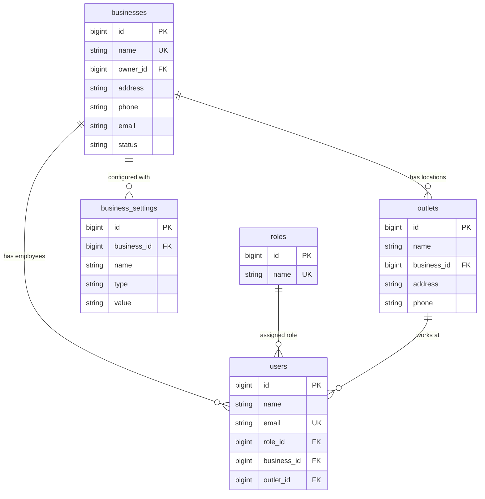

### Module 2: Product & Inventory Management

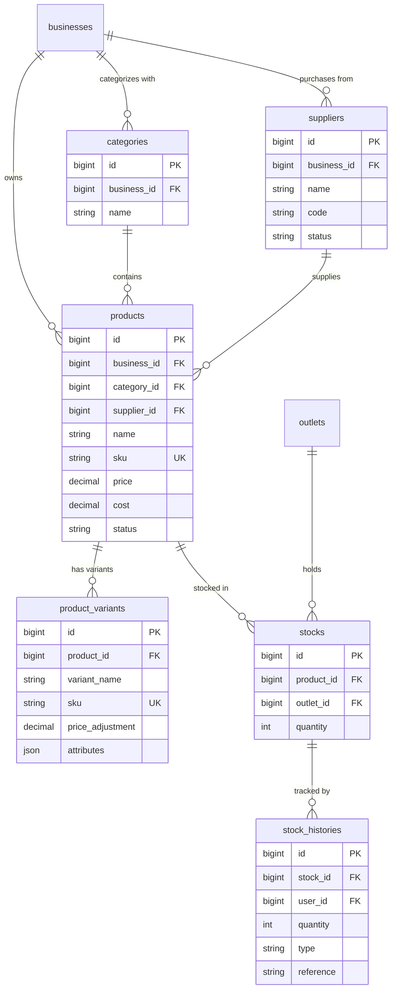

### Module 3: Sales & Orders

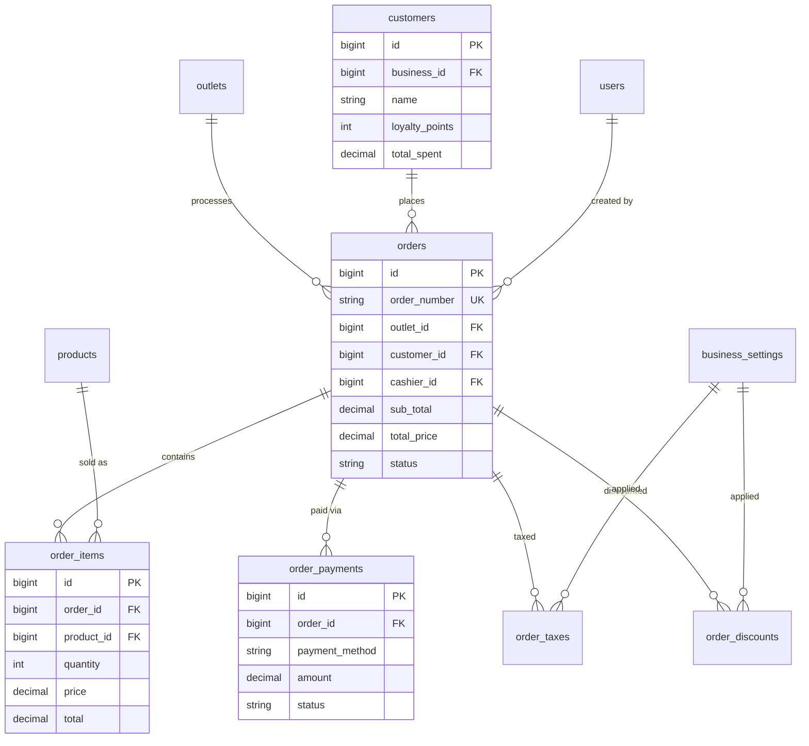

### Module 4: Purchase Orders & Supply Chain

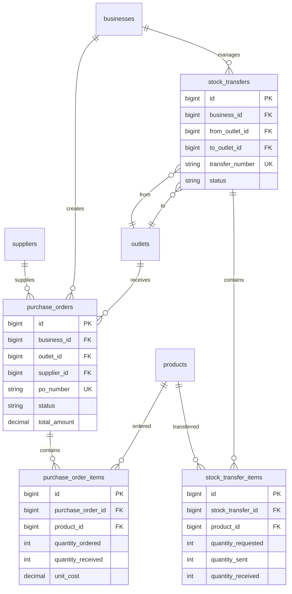

### Module 5: SaaS Subscription & Billing

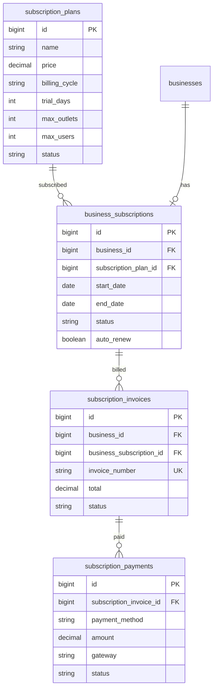

### Module 6: Employee Management

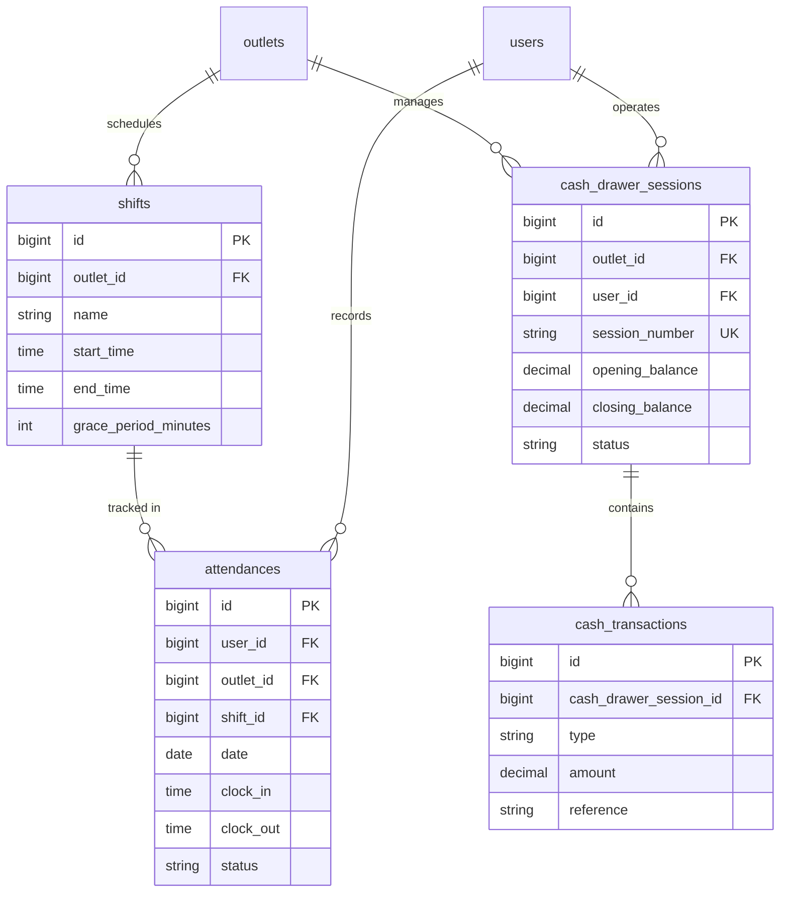

### Module 7: Marketing & Promotions

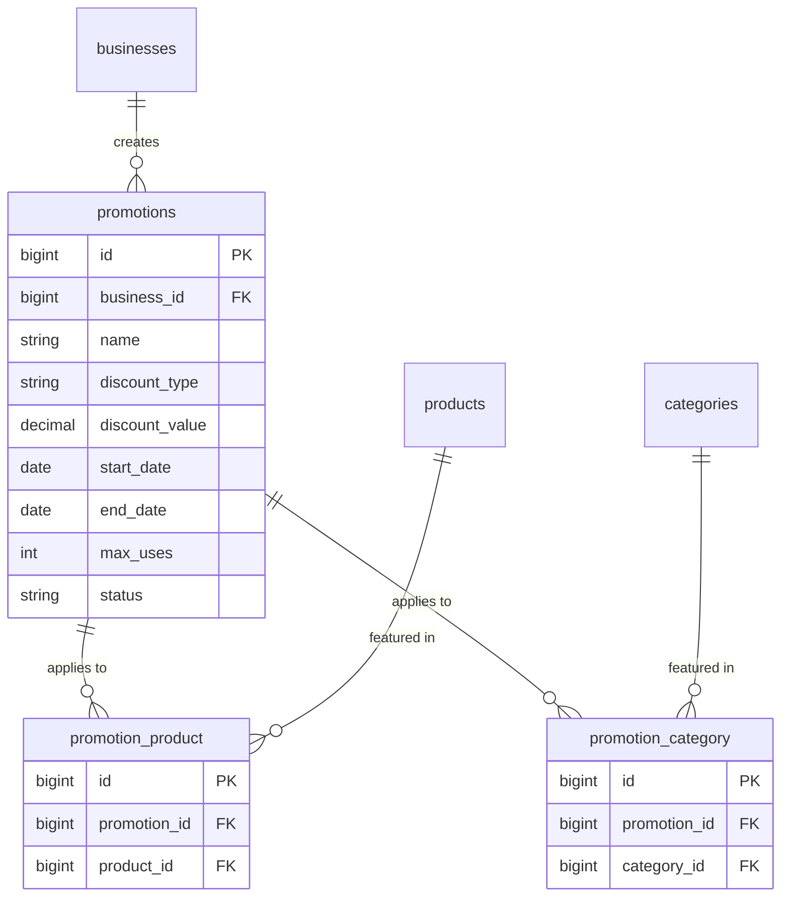

### Module 8: Returns & Refunds

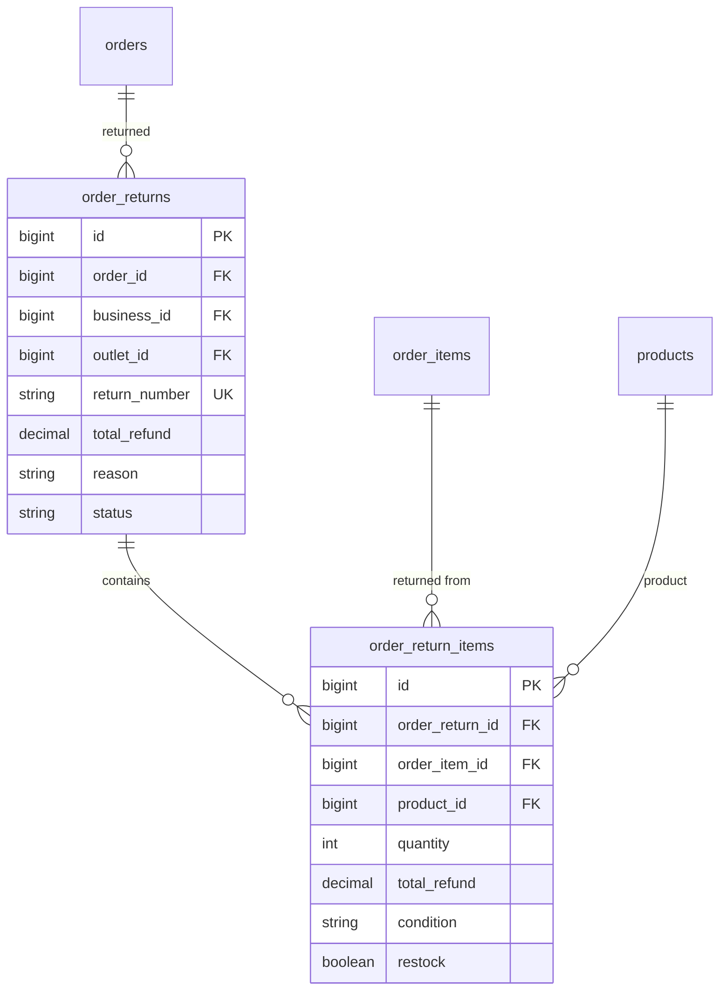

### Module 9: Reporting & Analytics

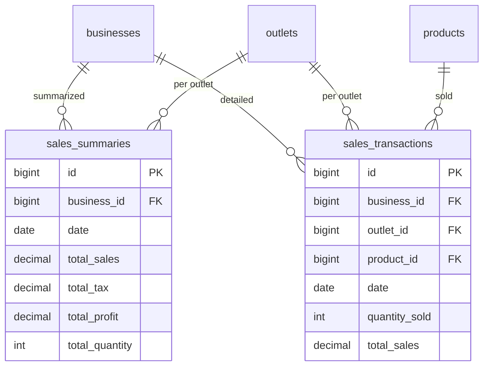

### Module 10: Audit & Monitoring

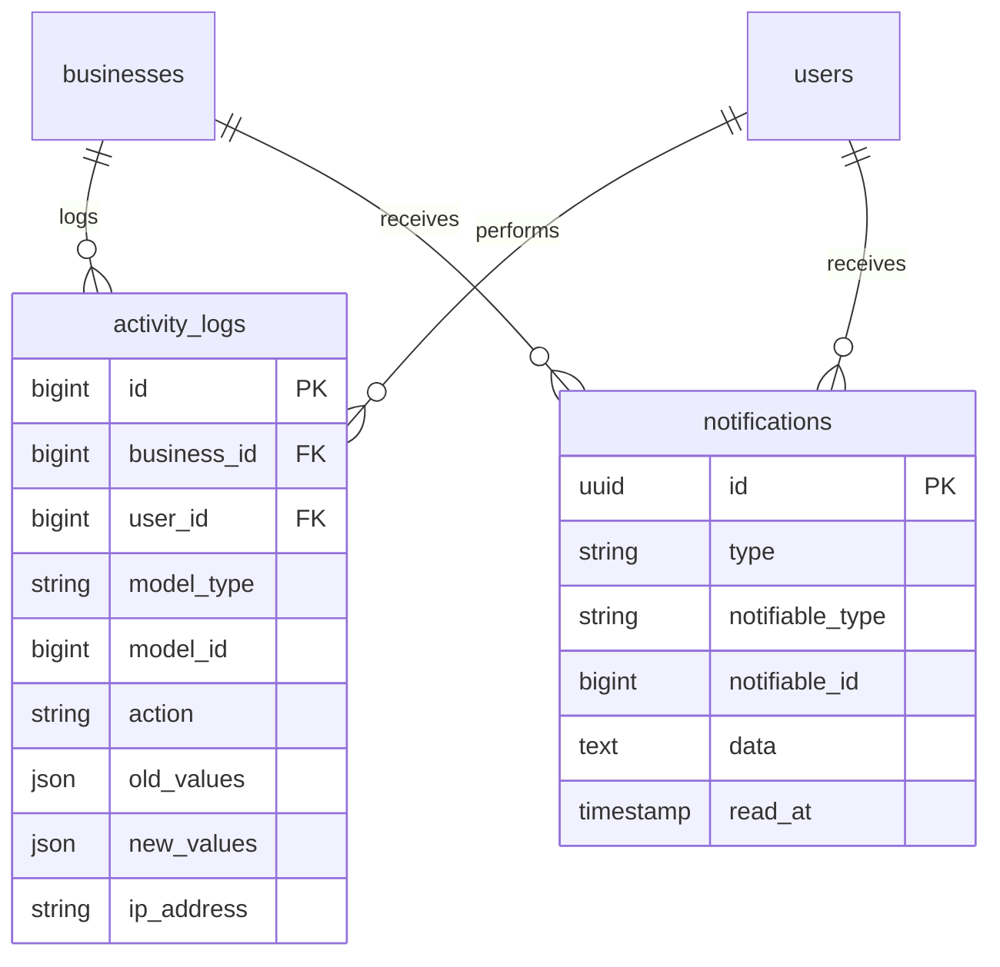

---

## How to View These ERDs

### Option 1: GitHub/GitLab
Upload this file to GitHub or GitLab - they natively render Mermaid diagrams.

### Option 2: Mermaid Live Editor
1. Go to https://mermaid.live/
2. Copy the Mermaid code
3. Paste and view interactive diagram
4. Export as PNG/SVG

### Option 3: VS Code
1. Install "Markdown Preview Mermaid Support" extension
2. Open this file in VS Code
3. Preview markdown (Ctrl+Shift+V)

### Option 4: Documentation Sites
Use in documentation generators like:
- MkDocs with mermaid plugin
- Docusaurus
- GitBook
- VuePress

---

## Legend

- **PK** = Primary Key
- **FK** = Foreign Key
- **UK** = Unique Key
- **||--o{** = One to Many
- **||--o|** = One to One
- **}o--||** = Many to One

---

*Document Version: 1.0*
*Last Updated: November 28, 2025*
